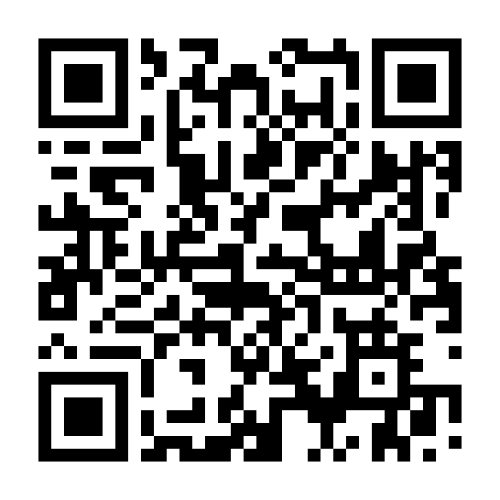

# Atividade Prática — "Campeonato de Revisão"

**Aula:** Revisão de Software: conceitos, tipos e papéis
**Duração:** 30 min de revisão + 15 min de comparação
**Formato:** 7 grupos (6 integrantes; G1 e G2 com 5) · **Data:** terça-feira, 15/09/2026

---

## 1. Situação

Você faz parte da equipe de desenvolvimento do **SIGA**, o sistema acadêmico da
universidade. Estamos a duas semanas do período de matrícula do semestre.

O desenvolvedor **@dev.junior** abriu o **Pull Request #1**, que implementa o
requisito **RF-014 — Matrícula de aluno em turma de disciplina**. Ele escreveu na
descrição do PR:

> *"Implementei o RF-014 conforme combinado na daily. Testes passando localmente
> (2/2 verdes). Acho que dá pra fazer o merge hoje."*

O pipeline está verde. A pessoa que revisaria o PR está de férias.
**Vocês são a revisão.**

## 2. O repositório

```
🔗  github.com/PPrauchner/siga-matricula
📄  PR #1 → aba "Files changed"      ← é AQUI que a revisão acontece
```



`https://github.com/PPrauchner/siga-matricula/pull/1/files`

**Não é preciso ter conta no GitHub.** Vocês só vão ler.

| Onde | O que é |
|---|---|
| **PR #1 → Files changed** | O diff sob revisão: `matricula.py` e `test_matricula.py` |
| `docs/RF-014.md` | Especificação do requisito — **a fonte da verdade** |
| `CONTRIBUTING.md` | Padrão de codificação da equipe |
| **Cartão de modo** (em papel) | **O método que o seu grupo vai aplicar** |
| **Ata de revisão** (em papel) | A entrega do grupo |

> ⚠️ **Cada grupo recebe um cartão de modo diferente.** Não troque de modo, não
> "melhore" o método no meio do caminho, e não olhe o que o grupo do lado está fazendo.
> A graça do exercício é justamente a comparação no final.

## 3. O que fazer

1. **(2 min)** Leiam o cartão do seu modo e **distribuam os papéis** ali descritos.
   Todo mundo tem um papel. Escrevam os nomes na ata.
2. **(20 min)** Executem a revisão **exatamente como o cartão manda**. O cronômetro
   é público — quando fecharem 20 min, param, mesmo no meio de um achado.
3. **(8 min)** Consolidem a **ata de revisão**: cada defeito recebe um ID, localização
   (arquivo + linha), tipo, severidade e descrição. Ao final, levem os números para o
   quadro no projetor.

## 4. Regras da revisão

- **Não comentem no GitHub.** Os achados vão para a ata em papel. Se os grupos
  comentarem no PR, todo mundo vê os achados de todo mundo e a comparação final morre.
- **Ferramentas automáticas estão proibidas:** sem linter, sem análise estática
  (`ruff`, `bandit`, `pylint`), sem Copilot, sem assistente de IA.
  *Exceção:* os grupos com o cartão de **Revisão assistida por IA**, e apenas com o
  prompt que receberam.
- **Revisa-se o artefato, não a pessoa.** Nenhum comentário sobre o autor.
- **Registrar o defeito, não debater a solução.** Se o grupo gastar 5 minutos discutindo
  como consertar, perdeu 5 minutos de detecção. Anote e siga.
- **Achado sem localização não conta.** Todo defeito precisa de arquivo + linha.
- **Falso positivo custa.** No quadro final, cada grupo reporta também quantos achados
  não se confirmaram. Metralhar não vence o campeonato.

## 5. Como o "campeonato" é pontuado

Cada grupo reporta 4 números:

| Métrica | Como medir |
|---|---|
| **Defeitos reais encontrados** | Quantos dos achados batem com o gabarito (0 a 12) |
| **Falsos positivos** | Achados que não são defeitos reais |
| **Defeitos críticos encontrados** | Quantos dos 5 defeitos de severidade Alta o grupo pegou |
| **Achado exclusivo** | Algum defeito que **só o seu grupo** encontrou |

> O gabarito tem **12 defeitos-alvo**, mas o artefato contém outros problemas legítimos
> além deles. Achado real fora da lista dos 12 **não é falso positivo** — vale como
> achado exclusivo.

> Não existe grupo vencedor por acaso: **cada modo de revisão é bom em achar uma
> classe diferente de defeito**. Descobrir *qual* é a lição da aula.

## 6. Entrega

A **ata de revisão preenchida** (uma por grupo), entregue à professora ao final da aula.
Ela vale como registro de participação e é o artefato real que uma revisão produz.
